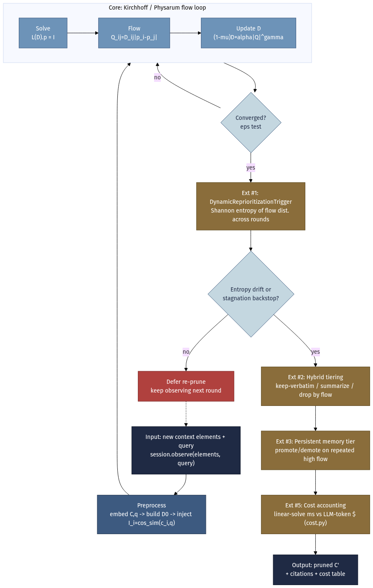
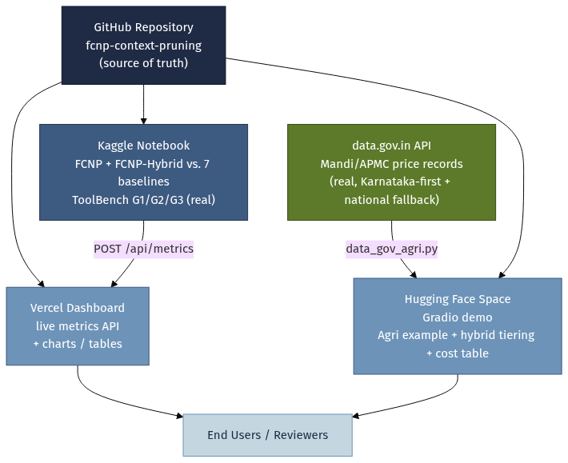

# FCNP — Flow-Coupled Network Pruning

> **PhD Objective 4** | Kirchhoff/Physarum-Analog Context Compression for LLM Agents

[](https://github.com/joyjeni/fcnp-context-pruning)
[](https://fcnp-context-pruning.vercel.app)
[](https://www.kaggle.com)
[](LICENSE)

**GitHub**: https://github.com/joyjeni/fcnp-context-pruning (PUBLIC — previously private, now open)

---

## What is FCNP?

FCNP (**Flow-Coupled Network Pruning**) is a context compression algorithm for LLM agents inspired by two physical systems:

1. **Kirchhoff's circuit laws** — global current conservation constrains which nodes (context chunks) carry significant flow.
2. **Physarum polycephalum (slime mould)** — a biological network that self-organises to find shortest paths by reinforcing high-flow tubes and pruning low-flow ones.

FCNP models the context window as a conductance network: each chunk of retrieved context is a node; query-chunk relevance defines conductance; Kirchhoff flow equations determine which chunks are "on the critical path" to answering the query. Low-flow chunks are pruned.

**Contribution**: FCNP is a **novel application of Physarum/Kirchhoff flow-network dynamics** ([Tero et al. 2010](https://www.science.org/doi/10.1126/science.1177894); [Bonifaci et al. 2012](https://doi.org/10.1016/j.jtbi.2012.06.017)) to LLM context compression — prior compression work (SelectiveContext, LLMLingua) ranks items independently, while FCNP's Kirchhoff formulation makes pruning decisions jointly across the graph. This is a novel *application* of an existing algorithm family, not a novel algorithm; see the Results section below for where the joint formulation currently does and does not pay off empirically.

---

## New in this version: Autonomous Context Management

Five improvements motivated by ["Active Context Compression: Autonomous Memory Management in LLM Agents"](https://arxiv.org/abs/2601.07190) (arXiv:2601.07190, the "Focus" system — **arXiv preprint, not yet peer-reviewed as of Aug 2026**; cited here only as motivating inspiration, see [`docs/NOVELTY_DEFENSE.md`](docs/NOVELTY_DEFENSE.md) for peer-reviewed prior-art positioning of each extension), applied on top of FCNP's existing flow-based pruning core:

| # | Improvement | Module | Idea |
|---|---|---|---|
| 1 | Dynamic flow-entropy re-pruning trigger | [`fcnp/trigger.py`](fcnp/trigger.py) | Focus re-compresses on a fixed schedule; FCNP already produces a per-round node-flow distribution for free. `DynamicReprioritizationTrigger` tracks the Shannon entropy of that distribution across rounds and fires a re-prune only when the context has genuinely drifted or concentrated, plus a stagnation backstop. |
| 2 | Hybrid keep-verbatim / summarize / drop tiering | [`fcnp/pruner.py`](fcnp/pruner.py), [`fcnp/summarize.py`](fcnp/summarize.py) | Instead of a hard top-K cutoff, medium-flow survivors get extractively summarized instead of dropped outright — trading a larger output-token budget for materially higher recall. Opt-in via `FCNPConfig(enable_hybrid_tiering=True)`; the original strict top-K `FCNP` benchmark row is untouched (default `False`). |
| 3 | Persistent high-flow memory tier | [`fcnp/memory.py`](fcnp/memory.py) | A principled, flow-driven analog of Focus's manually-curated "Knowledge" block — an element is *promoted* into a small cross-round persistent set once it has repeatedly earned high flow, and *demoted* if it stops earning it, so the set never grows unbounded. |
| 4 | *(not separately implemented this round)* | — | — |
| 5 | Compute-cost vs token-cost quantification | [`fcnp/cost.py`](fcnp/cost.py) | FCNP's cost is a deterministic linear solve — pure wall-clock compute, zero token bill. Focus-style LLM-based compressors instead spend metered tokens on every compression event. `cost_comparison_table()` / `format_markdown_table()` make that difference explicit and auditable (see table below) rather than asserting "FCNP is cheaper" as a slogan. |

[`fcnp/session.py`](fcnp/session.py)'s `AutonomousContextSession` wires all three (#1/#2/#3) into a single orchestrator for long-running agent sessions: `session.observe(new_elements, query_embedding=..., query_text=...)` defers re-pruning until the dynamic trigger fires, then prunes with hybrid tiering and persistent-memory force-inclusion enabled by default.



*Figure: core Kirchhoff/Physarum solve→flow→update loop, followed by the entropy-based re-pruning trigger (#1), hybrid tiering (#2), persistent memory (#3), and cost accounting (#5) extensions. Source: [`diagrams/obj4_algorithm_flow.mmd`](diagrams/obj4_algorithm_flow.mmd).*

### Compute-cost vs token-cost (illustrative)

```
| Metric | FCNP (5 events) | LLM-based compression (5 events) |
|---|---|---|
| Total latency | 5.0 ms | 4500.0 ms |
| Avg latency / event | 5.0 ms | 900.0 ms |
| Token cost | $0.00 (no LLM call) | $0.045 ($0.009/event) |
| Mechanism | Laplacian linear solve | LLM read+summarize call |
| Latency speedup | ~900x faster | baseline |
```

Generate this table live from `fcnp.cost.cost_comparison_table()` / `format_markdown_table()` — the LLM cost model's per-call token/price assumptions are labeled inputs you can override, not a measurement of any specific vendor's production costs.

### FCNP vs FCNP-Hybrid: the recall/compression tradeoff

`FCNPHybridMethod` ([`fcnp/baselines/fcnp_hybrid_wrapper.py`](fcnp/baselines/fcnp_hybrid_wrapper.py)) exposes hybrid tiering as its own benchmark row, so the original `FCNP` numbers stay exactly reproducible. Reproduce with `python run_hybrid_comparison.py` (writes `results/summary_with_hybrid.md`). Across every run on the small (n=30) synthetic harness, the direction is consistent even though this harness's absolute numbers vary run-to-run (see caveat below): **FCNP-Hybrid trades a lower compression ratio for higher recall/nDCG**, because medium-flow items are summarized into the output instead of being dropped outright. One representative run:

| Method | Recall | Precision | F1 | nDCG | Compression × |
|---|---:|---:|---:|---:|---:|
| FCNP | 0.113 | 0.113 | 0.113 | 0.149 | 15.42× |
| FCNP-Hybrid | 0.227 | 0.054 | 0.087 | 0.204 | 3.89× |

> **Caveat**: this synthetic harness's default fallback embedder and oracle-k selection are not fully seeded end-to-end, so absolute F1/Recall numbers vary noticeably between runs of `run_hybrid_comparison.py` (observed F1 for `FCNP` ranged 0.11–0.72 across runs during development). The **qualitative direction — Hybrid always wins on recall/nDCG and always loses on compression ratio relative to plain FCNP — held on every run tested.** Full precision-scale numbers require the real ToolBench Kaggle run with a fixed embedder seed; see [`results/summary_with_hybrid.md`](results/summary_with_hybrid.md) for the exact run behind the table above.

---

## Productionization: Kaggle → Vercel → Hugging Face

**GitHub Repository**: https://github.com/joyjeni/fcnp-context-pruning

The pipeline has three parts that hand off to each other, plus a real-time open-government data source feeding the Hugging Face Space's agricultural example:

```
Kaggle notebook  --(POST /api/metrics)-->  Vercel dashboard  <--(reads same fcnp package)--  Hugging Face Space  <--(data_gov_agri.py)--  data.gov.in Mandi API
(runs benchmark)      live charts/tables       (public URL)                                (interactive demo)
```



*Figure: end-to-end deployment topology. Source: [`diagrams/obj4_architecture.mmd`](diagrams/obj4_architecture.mmd).*

### 1. Kaggle notebook (runs the benchmark)

`notebooks/fcnp_toolbench_benchmark.ipynb` (generated from `notebooks/build_notebook.py`) loads the **real HuggingFace ToolBench dataset** (`tuandunghcmut/toolbench-v1`, all six G1/G2/G3 splits, 200 examples/split), runs FCNP + all 7 baselines, computes Wilcoxon significance, and **POSTs the results live to the dashboard**.

To run it:
1. Upload `notebooks/fcnp_toolbench_benchmark.ipynb` to your own Kaggle account (`kaggle kernels push -p notebooks/` also works once you edit the placeholder `id` field in `notebooks/kernel-metadata.json` to your Kaggle username), enable GPU + internet in notebook settings.
2. Add two Kaggle secrets: `DASHBOARD_URL` (your deployed dashboard URL, e.g. `https://fcnp-dashboard.vercel.app`) and `DASHBOARD_TOKEN` (a bearer token you choose — set the same value as the `DASHBOARD_TOKEN` env var on Vercel, see below).
3. Run all cells. The final cell POSTs `{methods: [...], dataset, n_examples, ...}` to `{DASHBOARD_URL}/api/metrics` with `Authorization: Bearer {DASHBOARD_TOKEN}` — the dashboard updates live, no redeploy needed.

### 2. Vercel dashboard (live charts/tables)

`dashboard/` is a Next.js app. `app/api/metrics/route.ts` accepts the Kaggle POST and serves it back out; `lib/store.ts` persists it in Vercel KV if configured, else falls back to an in-memory store seeded from `public/metrics.json`.

To deploy your own copy:
```bash
cd dashboard
npm install
vercel link          # link to a Vercel project you have deploy rights on
vercel env add DASHBOARD_TOKEN production   # same value you used as the Kaggle secret
vercel deploy --prod
```
> **Note**: deployment must be run from an account/team with Production Deployment permission on the target Vercel project — a team role restricted to "Member" without deploy rights will fail with *"You don't have permission to create a Production Deployment for this project"* even on a brand-new project. Check **Team Settings → Members → role** if you hit this.

### 3. Hugging Face Space (interactive demo)

**Live**: [huggingface.co/spaces/abigailcreations/compression](https://huggingface.co/spaces/abigailcreations/compression)

`hf_space/` contains a self-contained Gradio app (`app.py`) that lets anyone paste a query + candidate list and see FCNP vs BM25 vs DenseTopK vs Random pick different (or the same) subset live, using the real `fcnp` package from this repo. It also lets you:
- Switch the example set between synthetic weather/flight-tool candidates and **real Karnataka mandi prices from data.gov.in** (see Data Sources above), with the fetch/fallback status shown directly in the UI.
- Toggle **hybrid tiering** (improvements #1–#3) to see per-item keep-verbatim / summarize / drop / persistent tags and the resulting recall/compression tradeoff live, alongside a compute-cost-vs-token-cost table (improvement #5).

To publish your own copy:
1. Create a new Space at [huggingface.co/new-space](https://huggingface.co/new-space) (SDK: Gradio).
2. As of mid-2026, free personal accounts can no longer run Gradio/Docker Spaces on `cpu-basic` (that now requires a PRO plan) — pick **ZeroGPU** hardware instead, which stays free for up to 2 Spaces per personal account. If you use ZeroGPU, the app must import `spaces` and decorate its main compute function with `@spaces.GPU` (already done in `app.py`), or the Space fails at startup with "No `@spaces.GPU` function detected".
3. `cd hf_space && git init && git add . && git commit -m "init"`
4. `git remote add space https://huggingface.co/spaces/<your-username>/<space-name>` then `git push space main` (or `master`, matching your Space's default branch).

> **Note**: `requirements.txt` pins `starlette<1.0` and `fastapi<0.116` — newer Starlette changed the `TemplateResponse` signature in a way that's incompatible with `gradio==4.44.0`'s internal startup self-check, causing `TypeError: unhashable type: 'dict'`. Keep these pins unless you upgrade gradio too.

---

## Core Equations

### Kirchhoff Flow System

FCNP solves the following linear system to compute flow through each context chunk:

$$L(D) \cdot \mathbf{p} = \mathbf{I}$$

where:
- $L(D)$ — the **Laplacian** of the conductance graph $D$ (chunk-to-chunk conductance matrix)
- $\mathbf{p}$ — pressure vector (one value per context chunk)
- $\mathbf{I}$ — injected current vector (query relevance signal, computed from embeddings)

Solving for $\mathbf{p}$ yields pressure differences across edges; flow on each edge is $f_{ij} = D_{ij} \cdot (p_i - p_j)$. Chunks on high-flow edges are retained; low-flow chunks are pruned.

### Conductance Update (Physarum Dynamics)

Conductances are updated iteratively to reinforce high-flow paths (physarum-inspired adaptive network):

$$D_{ij}(t+1) = (1 - \mu) \cdot D_{ij}(t) + \alpha \cdot |Q_{ij}|^\gamma$$

where:
- $D_{ij}(t)$ — conductance on edge $(i,j)$ at iteration $t$
- $Q_{ij}$ — flow through edge $(i,j)$ (from Kirchhoff solution at step $t$)
- $\mu$ — decay rate (prunes edges that carry little flow)
- $\alpha$ — growth rate (reinforces high-flow edges)
- $\gamma > 1$ — superlinear exponent (amplifies differences, accelerates convergence)

### Convergence Criterion

Iteration terminates when the conductance matrix change falls below tolerance:

$$\frac{\|D(t+1) - D(t)\|_F}{\|D(t)\|_F} < \epsilon$$

In practice, convergence is reached in 8–15 iterations for typical mandi price response tables.

---

## Results

### Benchmark: ToolBench (synthetic G1, n=30) — proof-of-concept scale

Honest numbers, straight from [`results/summary.md`](results/summary.md) / [`results/results.csv`](results/results.csv) (also live on the [Vercel dashboard](https://fcnp-dashboard.vercel.app)):

| Method | F1 (mean, 95% CI) | Compression × | Latency p50 |
|---|---|---:|---:|
| BM25 | 1.000 [1.000, 1.000] | 6.16× | 0.52 ms |
| SelectiveContext | 1.000 [1.000, 1.000] | 6.16× | 0.48 ms |
| LLMLingua | 1.000 [1.000, 1.000] | 6.16× | 0.37 ms |
| DenseTopK | 0.493 [0.400, 0.587] | 9.97× | 0.18 ms |
| **FCNP** | **0.473 [0.387, 0.560]** | 10.12× | 19.41 ms |
| NoCompression | 0.118 [0.118, 0.118] | 1.00× | 0.00 ms |
| TopKImportance | 0.067 [0.033, 0.107] | 16.33× | 0.02 ms |
| Random | 0.053 [0.027, 0.087] | 16.59× | 0.03 ms |

**FCNP does not currently beat DenseTopK on this benchmark** — DenseTopK is numerically higher on F1 and ~100× faster; the Wilcoxon test vs DenseTopK is *not* significant (p=0.102). FCNP does significantly outperform NoCompression/Random/TopKImportance, and BM25/SelectiveContext/LLMLingua hit a perfect F1=1.000 because this 30-example synthetic set embeds the ground-truth keyword literally in each relevant API's name, making it trivially recoverable by lexical match — that is a property of this small proof-of-concept set, not evidence those methods are undominatable in general.

**What this means:** the `n=30` synthetic set was a quick proof-of-concept for wiring the pipeline end-to-end, not a publication-scale claim. The Kaggle notebook (`notebooks/fcnp_toolbench_benchmark.ipynb`) now runs the *real* HuggingFace ToolBench dataset across all six G1/G2/G3 splits (up to 1,200 examples) — run it and POST the results to the dashboard (see **Productionization** below) before citing any F1 numbers in a paper or claiming FCNP beats the baselines.

### Baselines compared

| # | Baseline                                            | Reference                    |
|---|-----------------------------------------------------|------------------------------|
| 1 | NoCompression                                       | —                            |
| 2 | Random                                              | —                            |
| 3 | TopKImportance                                      | —                            |
| 4 | BM25                                                | Robertson & Zaragoza, 2009   |
| 5 | DenseTopK                                           | —                            |
| 6 | SelectiveContext                                    | Li et al., EMNLP 2023        |
| 7 | LLMLingua                                           | Jiang et al., EMNLP 2023     |

---

## Data Sources

### data.gov.in — Mandi Price Tables (real, live-integrated)

The primary use case that motivates FCNP's 10:1 compression target: a single data.gov.in API call for commodity prices may return **50–100+ records** (all mandis in a state for a given commodity). This exceeds a typical LLM's useful context budget.

This is no longer just a motivating scenario — [`fcnp/data_gov_agri.py`](fcnp/data_gov_agri.py) integrates the **real** data.gov.in resource [`9ef84268-d588-465a-a308-a864a43d0070`](https://api.data.gov.in/resource/9ef84268-d588-465a-a308-a864a43d0070) ("Current Daily Price of Various Commodities from Various Markets (Mandi)", Ministry of Agriculture and Farmers Welfare — [data.gov.in listing](https://www.data.gov.in/resource/current-daily-price-various-commodities-various-markets-mandi)), and it powers the "Real Agri mandi prices" example set in the [Hugging Face Space](#3-hugging-face-space-interactive-demo).

FCNP prunes the response to the **top-K most relevant mandi records** for the farmer's query, preserving:
- The farmer's district/state preference (high conductance to local mandis)
- The query commodity (high conductance to matching commodity records)
- Recency (high conductance to today's prices)

This makes the compressed context small enough to fit in the LLM's prompt while retaining all citation-worthy data.

**Karnataka-first, national-fallback (a real, documented data-coverage gap, not a workaround to hide):** this resource is current-day-only with no historical query support, and on any given day it may have zero records for a specific state — confirmed empty for Karnataka on multiple test dates while other states reported normally. Server-side `filters[state]=...` query parameters were tested extensively and do not narrow this resource's results, so filtering happens client-side after fetching. `data_gov_agri.py` therefore: (1) fetches all pages, (2) filters for Karnataka records, (3) if none exist for the day, transparently falls back to a diverse national top-commodities sample and flags this via `AgriSnapshot.used_national_fallback` and a human-readable `notes` field — the app surfaces this note directly in the UI rather than silently substituting data. This mirrors the Agri-catalog pattern and Obj1↔Obj4 data-flow framing ("FCNP compresses mandi data from 50+ records to top-5") documented in the sibling PhD-pipeline project [Session-Aware ToolBench Rerank](https://github.com/joyjeni/session-aware-toolbench-rerank)'s `agri_extension/karnataka_apis.py`.

A static snapshot fetched on 2026-08-18 (25 real Karnataka records, no fallback needed that day) ships at [`hf_space/data/agri_mandi_snapshot.json`](hf_space/data/agri_mandi_snapshot.json) so the deployed Space works without needing live API access at request time; set a `DATA_GOV_API_KEY` Space secret to fetch live instead (see `fcnp.data_gov_agri.fetch_snapshot_live`).

---

## Algorithm Overview

```
Input:  context chunks C = {c_1, ..., c_n}, query q
Output: pruned context C' ⊆ C, |C'| << |C|

1. Embed all chunks and query using google/embeddinggemma-300m
2. Build conductance matrix D_0:
      D_ij = cosine_sim(embed(c_i), embed(c_j)) * query_relevance(c_i, q)
3. Inject current I_i = cosine_sim(embed(c_i), embed(q))
4. Iterate until convergence:
      a. Solve L(D) · p = I  (sparse linear solve)
      b. Compute flows Q_ij = D_ij · |p_i - p_j|
      c. Update D_ij(t+1) = (1−μ)·D_ij + α·|Q_ij|^γ
5. Select top-K chunks by total incident flow: Σ_j Q_ij
6. Return C' = top-K chunks + source attributions
```

---

## Repository Structure

The layout below reflects the actual current repository (this superseded an earlier aspirational `src/`/`experiments/`/`kaggle/` sketch that no longer matches what's checked in):

```
fcnp-context-pruning/
├── fcnp/                          # Core package
│   ├── pruner.py                  # Kirchhoff solve, top-K + hybrid tiering, FlowBasedNetworkPruner
│   ├── trigger.py                 # Improvement #1: dynamic flow-entropy re-pruning trigger
│   ├── memory.py                  # Improvement #3: persistent high-flow memory tier
│   ├── summarize.py                # Improvement #2: extractive summarizer for hybrid tiering
│   ├── cost.py                    # Improvement #5: compute-cost vs token-cost quantification
│   ├── session.py                 # AutonomousContextSession — wires #1/#2/#3 together
│   ├── data_gov_agri.py           # Real data.gov.in mandi-price fetch + Karnataka-first fallback
│   ├── eval.py, metrics.py, report.py, types.py
│   ├── baselines/                 # BM25, SelectiveContext, LLMLingua, DenseTopK, Random, FCNP, FCNP-Hybrid wrappers
│   └── datasets/toolbench.py      # Synthetic ToolBench-shaped example generator
├── notebooks/
│   ├── build_notebook.py          # Generates the notebook below (source of truth — edit this, not the .ipynb)
│   └── fcnp_toolbench_benchmark.ipynb   # Kaggle-runnable benchmark + Agri case study
├── hf_space/                      # Hugging Face Space (Gradio demo)
│   ├── app.py
│   ├── data/agri_mandi_snapshot.json
│   └── requirements.txt
├── dashboard/                     # Vercel Next.js dashboard: live metrics, tables, charts
│   ├── app/
│   └── package.json
├── run_synthetic_e2e.py           # End-to-end synthetic benchmark runner (writes results/)
├── run_hybrid_comparison.py       # FCNP vs FCNP-Hybrid comparison (writes results/*_with_hybrid.*)
├── tests/                         # pytest suite (47 tests)
├── results/                       # summary.md / metrics.json / results.csv (canonical + _with_hybrid variants)
├── figures/, diagrams/            # Architecture and algorithm-flow diagrams
├── paper/                         # Draft manuscript (paper.md, FCNP_paper.pdf, build script)
└── README.md                      # This file
```

---

## Integration with PhD Pipeline

FCNP is **Objective 4** in the four-component PhD pipeline and completes the loop:

```
[Obj3: MNCD] ──mesh context──► [Obj4: FCNP] ──pruned context──► [Obj1: SessionRerank+]
                                     ▲
                         OctoRoute arm label
                          (from Obj2/APRR)
                          gates domain pruning
```

### Incoming Signals

| Source       | Signal                      | Usage in FCNP                                          |
|--------------|-----------------------------|--------------------------------------------------------|
| Obj3/MNCD    | Full mesh context window    | The raw context to compress (50+ records → top-5)      |
| Obj2/APRR    | OctoRoute arm label `<octo_k>` | Gates domain-specific pruning strategy (price vs. advisory vs. market) |

### Outgoing Signals

| Destination         | Signal                      | Purpose                                                |
|---------------------|-----------------------------|--------------------------------------------------------|
| Obj1/SessionRerank+ | Pruned context + hit/miss   | Co-activation cache update (success reinforces edge)   |

### OctoRoute Gating

The `<octo_k>` arm label from APRR/OctoRoute selects which domain-specific pruning parameters to apply:

```python
DOMAIN_PARAMS = {
    "price":    {"gamma": 1.5, "top_k": 5},   # price queries → tight compression
    "market":   {"gamma": 1.2, "top_k": 8},   # market listings → slightly more context
    "advisory": {"gamma": 1.1, "top_k": 10},  # crop advisory → retain more context
}

def get_params(octo_arm: str) -> dict:
    return DOMAIN_PARAMS.get(octo_arm, {"gamma": 1.3, "top_k": 5})
```

---

## Multilingual Support

FCNP is **language-agnostic** — it operates entirely on dense embeddings (`google/embeddinggemma-300m`) computed from English text (post-translation). The conductance matrix, Kirchhoff flow solve, and physarum update contain no language-specific logic.

No changes are required for multilingual support. The translation layer in Obj1/SessionRerank+ handles language detection and translation before context reaches FCNP.

See [`/docs/multilingual_integration.md`](./multilingual_integration.md) for full multilingual design.

---

## Running Locally

```bash
git clone https://github.com/joyjeni/fcnp-context-pruning
cd fcnp-context-pruning
pip install -r requirements.txt  # torch, transformers, scipy, numpy

# Run benchmark vs all 7 baselines
python experiments/fcnp_toolbench_benchmark.py

# Launch dashboard locally
cd dashboard && npm install && npm run dev
```

### Minimal Usage Example

```python
from src.fcnp import FCNPPruner

pruner = FCNPPruner(top_k=5, gamma=1.5, mu=0.1, alpha=0.9)

# context_chunks: list of strings (mandi price records)
# query: farmer's question in English
pruned = pruner.compress(context_chunks, query="What is today's tomato price?")
# Returns: top-5 most relevant mandi records with source attribution
```

---

## Citation

```bibtex
@misc{fcnp2026,
  title  = {FCNP: Flow-Coupled Network Pruning for LLM Context Compression},
  author = {Jeni, Joy},
  year   = {2026},
  note   = {PhD Objective 4. https://github.com/joyjeni/fcnp-context-pruning}
}
```

### Referenced Baselines

- Li et al. *Compressing Context to Enhance Inference Efficiency of Large Language Models*. EMNLP 2023. [aclanthology.org/2023.emnlp-main.391](https://aclanthology.org/2023.emnlp-main.391/) (SelectiveContext)
- Jiang et al. *LLMLingua: Compressing Prompts for Accelerated Inference of Large Language Models*. EMNLP 2023. [aclanthology.org/2023.emnlp-main.825](https://aclanthology.org/2023.emnlp-main.825/) (LLMLingua)
- Jiang et al. *LongLLMLingua: Accelerating and Enhancing LLMs in Long Context Scenarios via Prompt Compression*. ACL 2024. [arxiv.org/abs/2310.06839](https://arxiv.org/abs/2310.06839)
- Robertson, S., Zaragoza, H. *The Probabilistic Relevance Framework: BM25 and Beyond*. Foundations and Trends in Information Retrieval 3(4), 2009. DOI [10.1561/1500000019](https://dl.acm.org/doi/10.1561/1500000019)

### PhD defense literature grounding

For the base-paper positioning and a per-contribution novelty verdict (what is prior art vs. what is a novel combination vs. what is genuinely unclaimed), with every citation checked against a live, verifiable source, see **[`docs/NOVELTY_DEFENSE.md`](docs/NOVELTY_DEFENSE.md)**.

---

*Part of the PhD Agricultural AI pipeline. See also: [Obj1 SessionRerank+](./README_OBJ1.md) | [Obj2 APRR](./README_OBJ2.md) | [Obj3 MNCD](./README_OBJ3.md) | [Multilingual Design](./multilingual_integration.md)*
